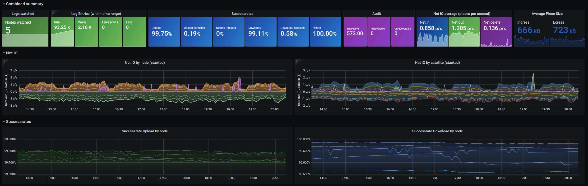

# storj-log-exporter
Grok Prometheus exporter for storj storagenode logs

# Installation using Docker

## Clone the repository and build the container

```
git clone https://github.com/kevinkk525/storj-log-exporter
cd storj-log-exporter
sudo docker build -t storj-log-exporter .
```

## Start the container

```
sudo docker run -d --restart unless-stopped --user "1000:1000" \
    -p 9144:9144 \
    --mount type=bind,source="<path_to_your_logfiles>",destination=/app/logs \
    --name storj-log-exporter
    storj-log-exporter -config /app/config.yml
```

Change the container name to your liking, insert the path to your logfiles instead of <...>. The logfile needs to have the name "node.log".
If you run multiple exporter, make sure to change the port, e.g. -p 9145:9144 etc.
The user "1000:1000" should be fine unless your logfiles can't be read by that user.

Now you can check the output at http://<node_ip>:9144/metrics

## Configure in prometheus.yml

If you followed my [How-To monitor all nodes in your lan](https://forum.storj.io/t/how-to-monitor-all-nodes-in-your-lan-using-prometheus-grafana-linux-using-docker) on the storj forum, you should already have a job in prometheus.yml looking like this:
```
  - job_name: storagenode1
    scrape_interval: 30s
    scrape_timeout: 20s
    metrics_path: /
    static_configs:
      - targets: ["storj-exporter1:9651"]
        labels:
          instance: "node1"
```
Add the following to your existing job for each node:
```
  - job_name: storagenode1
    scrape_interval: 30s
    scrape_timeout: 20s
    metrics_path: /
    static_configs:
      - targets: ["storj-exporter1:9651","storj-log-exporter1:9144"]
        labels:
          instance: "node1"
```

Then restart prometheus. To see if it worked, check on the prometheus page the targets.

## Add dashboard to Grafana

Add the dashboard from the file [dashboard_log_exporter.json](./dashboard_log_exporter.json) in the same way as described in my [How-To monitor all nodes in your lan](https://forum.storj.io/t/how-to-monitor-all-nodes-in-your-lan-using-prometheus-grafana-linux-using-docker)

## Result



# Notes

The Error Count excludes falsely classified errors (e.g. shutdown of runner, download/upload failed due to client side errors, graceful exit errors if you GE’ed on stefan-benten).

Let me know if you miss a metric or if something is wrong.

# Future

I will publish a dashboard that combines the metrics from the [storj-exporter](https://github.com/anclrii/Storj-Exporter) and this storj-log-exporter but it might take a while.
